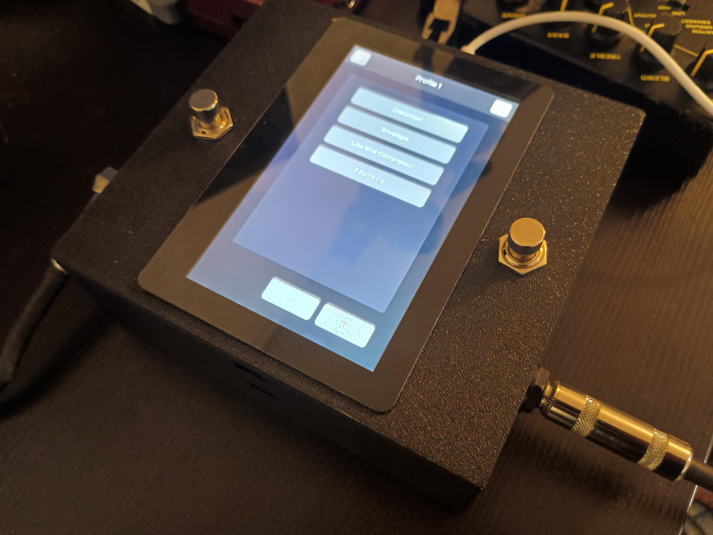
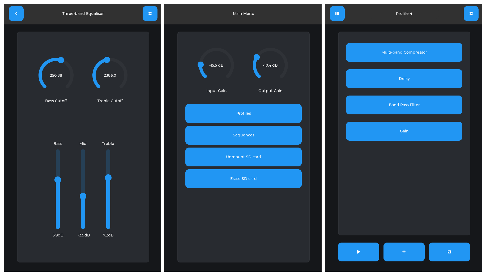

<p align="center">
  
</p>
<p style="text-align:center;">(Todo: get better picture)</p>

# M: The Everything Pedal

M is a digital effects pedal. It is:

- Effortless to use; press button, drag-and-drop, turn dial. No technical knowledge required.

It is also:

- A fully programmable, extremely powerful real-time digital signal processing platform.

M consists of two two devices;

- an MCU running [M-interface](https://github.com/linkin-parks-bassist/m-interface), the UI, control system and compiler for M, and 
- an FPGA running [M-FPGA](https://github.com/linkin-parks-bassist/m-fpga), a purpose-built, high-performance programmable hardware DSP engine,

in addition to a touch screen and all the hardware required for an effects pedal (PCB coming soon!).

---

## Features

<p align="center">
  
</p>

- Create pipelines with any effects in any order
- Real-time everything
- Re-order with drag-and-drop
- Smoothed parameter control
- Click/pop-less transitions
- Effects stored as simple text files on SD card
- Latency under 60μs
- Performs >100 million multiply-accumulate operations per second
- Powerful filter engine can compute arbitrary FIR, IIR filters

## Effect Descriptors

The M interface includes a parser and assembler for "effect descriptor" (`.eff`) files - a simple DSL with inline FPGA DSP assembly code. Example:

```
v1.0

.INFO

name: "Low Pass Filter"
cname: "example_low_pass_filter"

.PARAMETERS

cutoff: (name: "Cutoff",
         default: 1000,
         min: 60,
         max: sample_rate / 2 - 1,
         units: "Hz",
         scale = "logarithmic")
Q: (name: "Resonance", default: 1 / sqrt(2), min: 0.1, max: 3)

.DEFS

omega: 2 * pi * cutoff / sample_rate
alpha: sin(omega) / (2 * Q)

.RESOURCES

x1: (type: "mem")
x2: (type: "mem")
y1: (type: "mem")
y2: (type: "mem")

.CODE

mem_read c1 $x1
mem_read c2 $x2
mem_read c3 $y1
mem_read c4 $y2

macz [(1/2) * (1 - cos(omega)) / (1 + alpha)] c0
mac  [        (1 - cos(omega)) / (1 + alpha)] c1
mac  [(1/2) * (1 - cos(omega)) / (1 + alpha)] c2
mac  [        (2 * cos(omega)) / (1 + alpha)] c3
mac  [             (alpha - 1) / (1 + alpha)] c4

mem_write $x2 c1
mem_write $x1 c0
mem_write $y2 c3

mov_acc c0

mem_write $y1 c0
```

which implements a low-pass filter. M-interface creates the UI directly from the file.

#### Features

- Simple assembly code with friendly syntax
- FPGA register values computed just-in-time from real-time parameter values
- Inline math expressions
- Delay buffers and scratchpad memory with simple assembly interface
- Variable, dependent parameter bounds
- Support for continuous parameters and discrete "settings"
- UI generated from file
- Definable parameter widget type and appearance

# System Overview

<p align="center">
  
</p>

Audio is streamed to the FPGA via I2S, which executes DSP instructions programmed via SPI by the MCU. 

---

# [M-interface](https://github.com/linkin-parks-bassist/m-interface)

M-interface is the control system and compiler for M: The Everything Pedal. It uses FreeRTOS and LVGL to provide a graphical user interface for M. It allows users to create, edit, manage, apply and sequence presets using effects from a local library of effects stored in text files on the local SD card.

## Components

- Effect compiler
- FPGA control system
- Symbolic math engine
- Effect/profile/sequence management system
- Parameter control subsystem
- LVGL-based GUI framework
- State-capture system
- Files system

---

## Getting Started

### esp32

The display subsystem uses the Waveshare board support package for esp32-p4-nano (also works for esp32-p4-pico) and the Waveshare touch-LCD-5A.

To build for the esp32-p4, run:

```bash
idf.py build
```

and to flash:

```bash
idf.py flash
```

### Desktop

The repo includes an interface demo which will run on any POSIX system.

To build:

```bash
make
```

To run:

```bash
./M
```

A shared library can also be built containing the non-GUI components (profile system and `.eff` assembler):

```bash
make lib
```

To install:

```bash
sudo make lib_install
```

Then include:

```
#include <libM/m_lib.h>
```

and link with `-lM`.

---

# [M-FPGA](https://github.com/linkin-parks-bassist/m-fpga)

<p align="center">
  
</p>


Hardware DSP engine for M: The Everything Pedal.

Implements a fixed-point, pipelined, programmable audio processing core targeting Gowin GW2AR devices.

## Features

- Single cycle throughput for MAC instructions
- A/B pipelines with smoothed crossover and warmup
- Out-of-order execution with scoreboard hazard prevention
- Order enforced at commit boundary
- Delay buffer controller
- Arbitrary IIR filter engine
- Simple instruction set
- Variable fixed-point format controlled by instruction field
- Timing closure at 112.5MHz on GW2AR-18 (logic depth 10)

---

## Architecture

The engine streams audio over I2S, processes it, and transmits it via I2S. 

THe engine has dual DSP cores, which are hot-swapped at config time to allow real-time transitions without clicks or pops. 

Future versions plan to target FPGAs with wider multipliers to improve DSP precision.

---

## Core Microarchitecture

<p align="center">
  
</p>

Each core possesses a set of 16 *channels*. These behave similarly to registers in a load-store architecture, but are not preserved between samples.

When a new sample becomes available over I2S:

- channel 0 is sampled and sent to the mixer
- channel 0 is overwritten with the new input sample
- the programmed sequence of blocks is executed

Each block also has a pair of immutable **block registers**, written only via SPI commands.

A wide accumulator (40 bits when `data_width = 16`) supports the multiply-accumulate instructions `macz`, `mac`, `umacz`, `umac`, and `mov_acc`.

The execution pipeline includes:

- instruction decode
- operand fetch with scoreboard hazard detection
- execution branches
- commit master for ordered side effects

With skid buffers inserted to break long combinational chains, the pipeline achieves single-cycle throughput in the absence of dependency stalls. At 112.5 MHz and 44.1 kHz sample rate, the theoretical maximum is 2551 operations per sample.

---

## Resource Units

Dedicated branches exist for dispatching operations to hardware resources:

- Lookup tables
- Memory
- Delay buffers
- Filters

### Lookup Tables

Two LUTs currently exist: `sin(2πx)`, `tanh(4x)`. These support tone generation, LFOs, and distortion effects.

### Memory

A SRAM block allows values to persist between samples, enabling filters, envelope trackers, and other stateful DSP.

### Delay Buffers

A delay buffer controller manages delay lines.

Buffers are allocated via SPI commands and accessed with the isntructions `delay_read` and `delay_write`.

The modulation parameter enables fractional delay modulation, making phasers and flangers possible. Prefetching hides SDRAM latency.

### Filters

The filter engine computes arbitrary filters of the form

```
y[n] = Σ a[n-k] x[n-k] + Σ b[n-l] y[n-l]
```

with streamed, single-cycle multiplications. 

---

## License

GNU GPL 3.0

## Contact

I'd love to hear from you.  
email: davidjfarrell96@gmail.com
